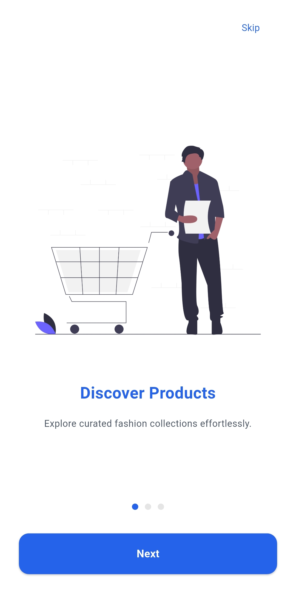
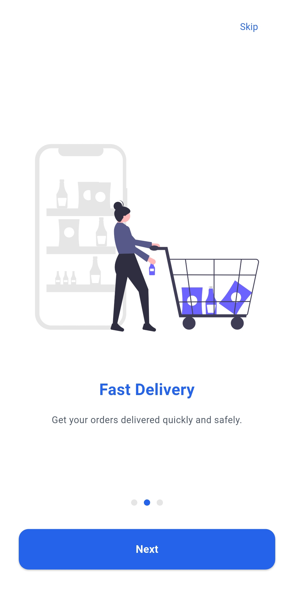
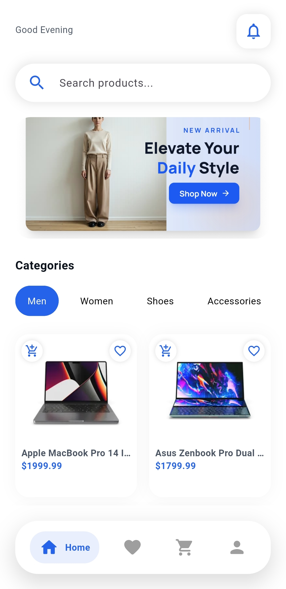
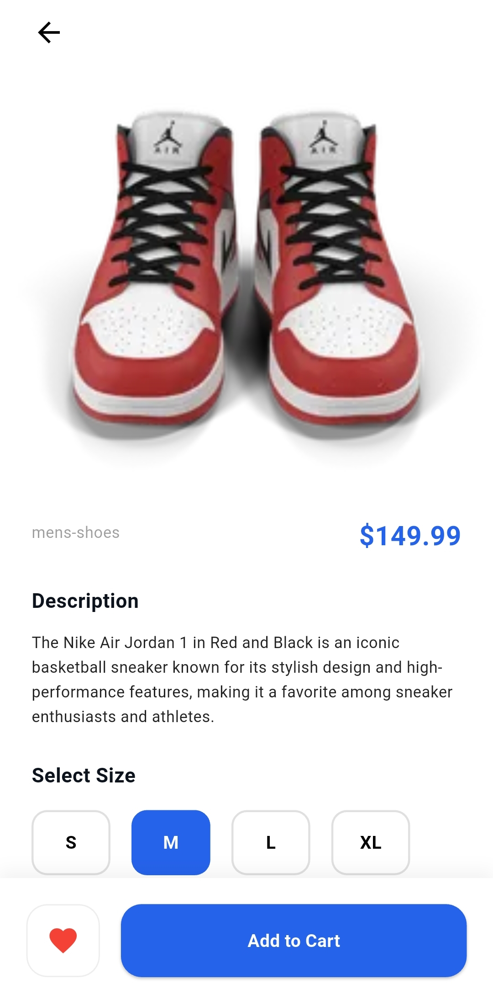
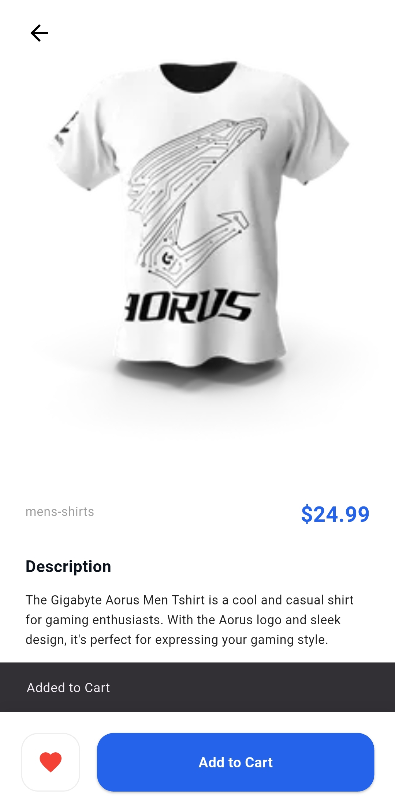
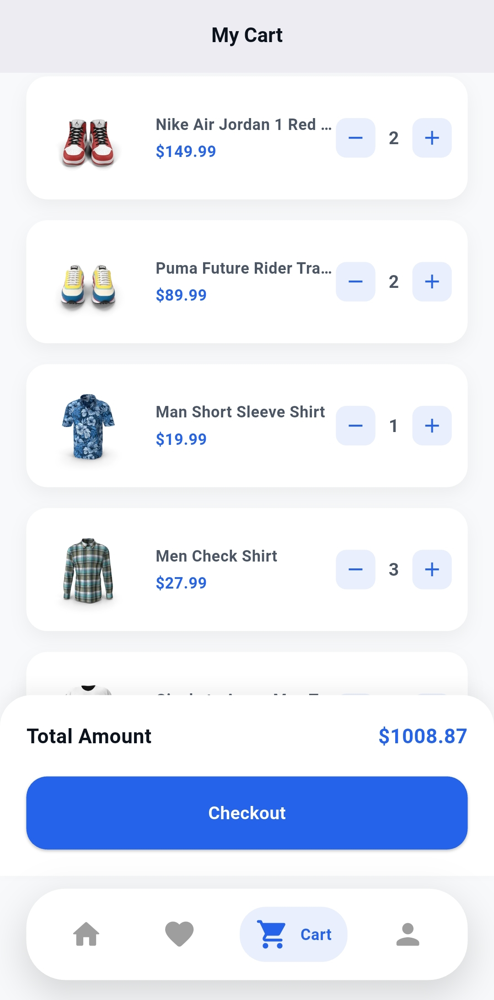
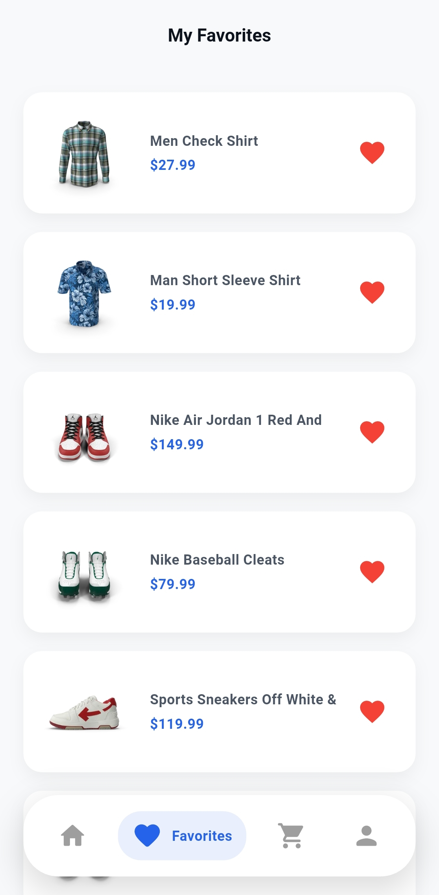
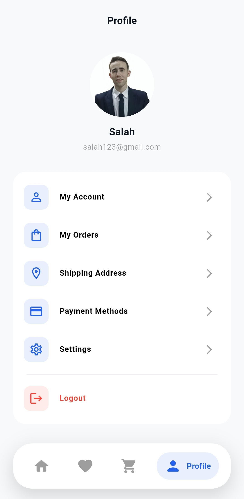

# 🛒 Cartify App

A modern Flutter eCommerce application built to provide a smooth and clean online shopping experience 📱✨

Cartify App allows users to browse products, search by categories, manage favorites, add items to cart, and explore product details with a responsive and modern UI 🎨

---

# 💙 About The Project

This project was built to practice real-world Flutter development concepts through creating a complete eCommerce application 🚀

The app focuses on:

* Clean Architecture 🏗️
* Smooth User Experience 📱
* API Integration 🌐
* State Management 🧠
* Organized Project Structure 🧩
* Responsive Design 📲
* Reusable Components ♻️
* Modern UI Design 🎨

The project also helped improve skills in:

* REST APIs Integration 🔗
* Dio Networking 🌍
* Cubit & Bloc State Management ⚡
* Authentication Flow 🔐
* Search & Filtering 🔎
* Cart Management 🛍️
* Favorites System ❤️
* Navigation & Routing 🚀
* Theme Management 🌙

---

# 🎥 Demo Preview

Watch Demo Video 🎬

https://www.linkedin.com/posts/salah-hassan66190_flutter-mobiledevelopment-dart-activity-7459675615818829824-NzqZ?utm_source=share&utm_medium=member_android&rcm=ACoAAFY2TGMBI-LuRPjN8vwwkj21qlrQwdAev7M

---

# 📱 App Screenshots

<div align="center">





<br/>


<br/>





<br/>





</div>

---

# ✨ Features

* Modern eCommerce UI 🛒
* Product Listing & Categories 📦
* Product Details Screen 📱
* Search & Filtering 🔎
* Add To Cart Functionality 🛍️
* Favorites Management ❤️
* Authentication Screens 🔐
* Onboarding Flow ✨
* Responsive Layout 📲
* Bottom Navigation Bar 📌
* API Integration 🌐
* Shared Preferences Local Storage 💾
* Smooth Navigation 🚀
* Reusable Widgets ♻️
* Organized Project Structure 🧩

---

# 🛠 Tech Stack

## 🚀 Framework & Language

* Flutter
* Dart

## 🧠 State Management

* flutter_bloc
* equatable

## 🌐 Networking

* dio

## 💾 Local Storage

* shared_preferences

## 🎨 UI & Utilities

* flutter_screenutil
* flutter_svg
* cached_network_image
* google_fonts
* smooth_page_indicator
* cupertino_icons

## 🧪 Development Tools

* flutter_lints
* device_preview

---

# 📂 Folder Structure

```bash id="jlwm153"
lib/
├── core/
│    ├── constants/
│    ├── network/
│    ├── themes/
│    └── utils/
│
├── features/
│    ├── splash/
│    │    ├── screens/
│    │    └── cubit/
│
│    ├── onboarding/
│    │    ├── screens/
│    │    └── cubit/
│
│    ├── auth/
│    │    ├── cubit/
│    │    ├── models/
│    │    ├── services/
│    │    ├── screens/
│    │    └── widgets/
│
│    ├── home/
│    │    ├── cubit/
│    │    ├── models/
│    │    ├── services/
│    │    ├── screens/
│    │    └── widgets/
│
│    ├── product_details/
│    │    ├── cubit/
│    │    ├── models/
│    │    ├── services/
│    │    ├── screens/
│    │    └── widgets/
│
│    ├── cart/
│    │    ├── cubit/
│    │    ├── models/
│    │    ├── services/
│    │    ├── screens/
│    │    └── widgets/
│
│    ├── favorites/
│    │    ├── cubit/
│    │    ├── screens/
│    │    └── widgets/
│
│    ├── profile/
│    │    ├── cubit/
│    │    ├── screens/
│    │    └── widgets/
│
│    ├── main_layout/
│    │    ├── cubit/
│    │    └── screens/
│
└── main.dart
```

---

# 🚀 Getting Started

Clone the repository 📦

```bash id="jlwm154"
git clone https://github.com/SalahHassan202/flutter_cartify_app.git
```

Go to project folder 📂

```bash id="jlwm155"
cd flutter_cartify_app
```

Install dependencies ⚙️

```bash id="jlwm156"
flutter pub get
```

Run the app ▶️

```bash id="jlwm157"
flutter run
```

---

# 👨‍💻 Author

Salah Hassan

🔗 GitHub
https://github.com/SalahHassan202
